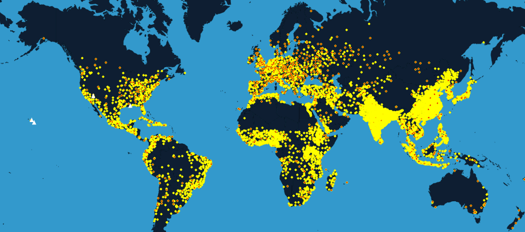
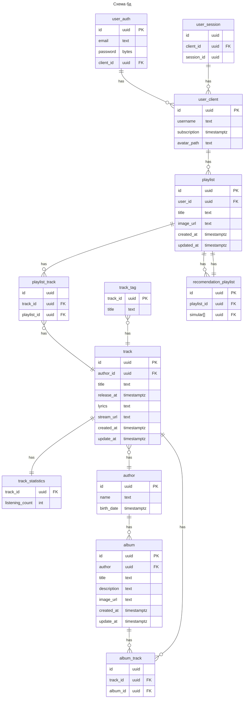

# Highload-Spotify

## Содержание
* #### [Тема и целевая аудитория](#1)
* #### [Рассчет нагрузки](#2)
* #### [Источники](#3)

## Часть 1. Тема и целевая аудитория <a name="1"></a>

### Тема курсовой работы - **"Проектирование высоконагруженного музыкального стримингового сервиса"**

[Spotify](https://open.spotify.com/) — стриминговый сервис, позволяющий легально прослушивать музыкальные композиции, аудиокниги и подкасты, не скачивая их на устройство.

### Ключевой функционал MVP:
- Регистрация и авторизация
- Создание страницы автора
- Загрузка треков (для автора)
- Создания плейстов (для пользователя)
- Разбиение треков по жанрам
- Рекомендации (на основе подписок и истории прослушивания)
- Стриминг аудио в разном кчестве
- Статистика по исполнителю
    - Количество прослушиваний по странам
    - Количество подписчиков

### Целевая аудитория:
Spotify является мировым лидером в области музыкального стриминга и имеет на ```4Q 2023-его года``` ```30.5%``` от общей доли продаваемых подписок, что составляет ```266 млн.``` пользователей.[^1]

По данным[^2] дневная аудитория сервиса составляет ```44%``` => 

```
618*0.44 = 271.92 млн. ≈ 272 млн.
```

- ```618 милионов``` **MAU** на Февраль 6, 2024.[^3]
- ```272 миллионов``` **DAU** на Февраль 6, 2024[^3]
- На возрастную группу ```18-35 года``` приходится ```55%``` всех пользователей Spotify.[^3]

### Распределение по странам [^3] :

| **Страна**     |  **Доля пользователей**           |
|----------------|:---------------------------------:|
| США            |                27.34%             |
| Бразилия       |                4.65%              |
| Великобритания |                4.58%              |
| Мексика        |                4.49%              |
| Индия          |                3.77%              |
| Канада         |                3.41%              |

| Пол       | Процентное соотношение  |
|-----------|:-----------------------:|
| Мужчины   |          52.97          |
| Женщины   |          47.03          |

Среднее время нахождение на Spotify пользователем 100 минут.[^2]

## Часть 2. Рассчет нагрузки <a name="2"></a>

### Входные данные:
| Метрики                      | Значения |
|------------------------------|----------|
| **Месячная аудетория (MAU)** | 618 млн. |
| **Дневная аудетория (DAU)**  | 272 млн. |
| Кол-во новых песен в день    | 60 тыс.  |
| Кол-во платных пользователей | 239 млн. |

#### Качество
В Spotify качество аудиодорожки ( __Bitrate__ ) зависит от наличия подписки и от качества соединения. По данным с офф.сайта.[^4]

|                 | Free | Premium |
|-----------------|------------------|---------|
| Web Player      |                                                   ```128kbit/s``` | ```256kbit/s``` |
| Desktop, Mobile |  **Low**: ```24kbit/s``` **Medium**: ```96kbit/s``` **High**: ```160kbit/s``` | **Low**: ```24kbit/s``` **Medium**: ```96kbit/s``` **High**: ```160kbit/s``` **Very High**: ```320kbit/s``` |

### Данные:
Длительность одной композиции составляет в среднем 197 секунд[^2].

Количество песен в Spotify - 100 млн.[^2]

#### Размер хранилища аудиофайлов:

Размер 1 песни для каждого Bitrate

```
197 * 24 = 0,58 Мбайт
197 * 96 = 2,3 Мбайт
197 * 160 = 3,8 Мбайт
197 * 320 = 7,7 Мбайт
```

```
100 * 10^6 * (0,58 + 2,3 + 3,8 + 7,7) = 1438 TB
```

#### Размер хранилища текстов песен

Возьмем средний размер текста песени: ```3000 символов``` (__UTF-8__). Тогда:
```
3000 * 100 * 10^6 = 0.3 TB
```

#### Размер хранилища обложек

Пусть картинка обложки храниться в 3-ех форматах

```64 x 64```, webp = ```2,5 Кбайт```

```180 x 180```, webp = ```15 Кбайт```

```320 x 320```, webp = ```600 Kбайт```

Тогда:

```
(2,5 + 15 + 600) * 100 * 10^6 = 58 TB
```

#### Увелечение обема хранилища

Каждый день добавляется 60 тыс. песен.[^2]
Поэтому можно вычислить на сколько увеличивается хранилище каждый день:

```
60 * 10^3 * (0.58 + 2.3 + 3.8 + 7.7 + (2.5 + 15 + 600)/1024 + 3000/1024/1024)[МБ] = 899153.30 МБ/сут = 0.857 ТБ/сут
```

### Сетевой трафик
Ежедневное время использования Spotify по данным [^2] от ```99``` до ```140 мин```

Ср.Знач = ```118 мин.```

Предположим, что на прослушивание уходит ```80%``` => 118 * 0.8 = 95

Кол-во платных пользоветелей ```239 млн.``` из ```618 млн.``` - ```38%```

#### Дневной трафик
```
DAU * dur_DAU * stream = (272 * 10^6) * (95 * 60) * (0,38 * 320 + 0,62 * 160)/8 = 42,791,040,000,000 КБ/cут = 42791 TB/сут
```

Загрузка аудиофайла

```
N_s_day * song_size / day = (60 * 10^3) * (0.58 + 2.3 + 3.8 + 7.7) / (24 * 3600) * 8 = 80 Мбит/с
```

### RPS
**Авторизация**

Пусть запрос на авторизацию совершается раз в 3 месяца
```
MAU * auth_month / month = (618 * 10^6) * 3 / (30 * 24 * 3600) = 715 RPS
```
**Получение информации о своем плейлисте**

Пусть человек заходит в свою медиатеку 3 раза в день
```
DAU * n_media-use / day =  (272 * 10^6) * 3 / (24 * 3600) = 9445 RPS
```

**Получение информации об конкретном альбоме, плейлисте**

Пусть человек прослушивает 2 плейлиста в день:
```
DAU * n_playlist / day = (272 * 10^6) * 2 / (24 * 3600) = 6296 RPS
```
**Добавление трека в плейлист**

Пусть добавляет в плейлист в среднем 3 трека в день:
```
DAU * n_add-playlist / day = (272 * 10^6) * 3 / (24 * 3600) = 9444 RPS
```
**Создание плейлиста**

Пусть человек создает новый плейлист раз в 3 месяца:
```
MAU * n_add-pl / month = (618 * 10^6) * 3 / (30 * 24 * 3600) = 715 RPS
```
**Стриминг аудиофайла**

Средняя продолжительность одного аудиофайла - 197 сек.

Среднее время прослушивания песен в Spotify - 95 мин.
```
t_day / dur_mid = 95 * 60 / 197 = 29 треков в среднем пользователь слушает в день

DAU * n_tr / day = (272 * 10^6) * 29 / (24 * 3600) = 91296 RPS
```
**Загрузка аудиофайла**

Каждый день добавляется 60 тыс. песен
```
n_add-tr / day = (60 * 10^3) / (24 * 3600) = 0.7 RPS
```
**Получение информации о песне**

В среднем пользователь слушает в день 29 треков
```
DAU * n_tr / day = (272 * 10^6) * 29 / (24 * 3600) = 91296 RPS
```
**Рекомендации**

Рекомендации плейлистов приходят с каждым запросом плейлиста и альбома.

Предположим, что пользователь слушает по 3 трека из плейлиста => 29 треков в день / 3 = 10 плейлистов в день
```
DAU * n_pl-day / day = (272 * 10^6) * 10 / (24 * 3600) = 31481 RPS
```
**Поиск**

Пусть человек пользуется поиском 3 раза в день

```
DAU * n_search / day = (272 * 10^6) * 3 / (24 * 3600) = 9444 RPS
```

## 3. Глобальная балансировка нагрузки
### Нахождение ЦОДов


```Eu = 210 120 000```

```Na = 148 320 000```

```Sa = 135 960 000```

```India = 23 mil```

- Самый большой трафик идёт из Европы и Северной Америки, там будет находится дата-центр в Европе, чтобы обеспечить основные страны.
- В США и Бразилии будет расположен 3 и 4-ый дата-центр для обеспечения Северную и Южную Америку.





- Нью-Йорк (США)
- Сан-Франциско (США)
- Франкфурт (Германия)
- Лондон (Великобритания)
- Стокгольм (Швеция)
- Москва (Россия)
- Бразилиа (Бразилия)
- Мехико (Мексика)
- Токио (Япония)
- Дели (Индия)
- Сидней (Австралия)


### DNS балансировка
- Будет использовать Latency-based DNS, в результате чего пользователю будет подбираться ближайший дата-центр, будем использовать эту технологию для глобальной балансировки.
### BGP Anycast
- Внутри регионов будем использовать BGP Anycast (будем выдавать один ip для нескольких дата-центров, отправлять пользователя к ближайшему дата-центру, cdn серверу)
- Будем использовать CDN сервера для отдачи статики (музыка). Для этого будем кэшировать треки в дата-центрах и дальше рассылать по cdn серверам, также будем предоставлять провайдерам кэши для ускорения контента(ISP), чтобы снять нагрузку с cdn серверов.
- Кеш сервер будет работать так, отдавать пользователю контент и в моменты минимальной нагрузки загружать с cdn серверов новый контент.


## 4. Локальная балансировка нагрузки
### BGP/RIP балансировка
- В ДЦ будет стоять маршрутизатор, с помощью BGP маршрутизации будет распределять данные на балансировщик L7.
### L7 балансировщик
- Будем использовать Envoy, как более современное решение чем nginx. Будет кешировать некоторые запросы, решать проблему "медленного клиента". С помощью Weighted Least Connections будем распределять запросы на сервисы (поднятые в подах kubernetes).
- Проблему отказоустойчивости в рамках сервисов, будет решать kubernetes. Для балансировщиков будем использовать heartbeat linux.
### SSL termination:
- Будем использовать SSL Termination, чтобы снять нагрузку с серверов по расшифровке ssl, это будет делать L7 балансировщик.
- Session cache - будет кешировать сессию.

## 5. Логическая схема БД



## 6. Физическая схема БД

### Выбор хранилища данных:
- Для сессий воспользуемся redis(user_id, client_id, session_id string), хранилище in-memory и не сильно важно целостность данных, небольшая нагрузка `session`.
- Для хранения и стриминга аудиофайлов объёмом около 1500 ТБ, использовать облачное хранилище, дает гибкую масштабируемость, позволяет оптимизировать затраты на хранение и уменьшить затраты на обслуживание оборудования.
Из облачных сервисов **Amazon S3**, высокая доступность и надежность хранения, а также возможности для стриминга аудиофайлов с использованием CDN.
- Для основной БД отлично подойдет NoSQL СУБД - Cassandra. Децентрализованная, отказоустойчивая и надёжная база данных "ключ-значение". Решает проблемы наличия единой точки отказа, отказа серверов и о распределении данных между узлами кластера.

### Индексы
- В таблице track:
    - (track_id, created_at) B-tree
    - (title) GIN  (поиск)
- В таблице author:
    - (author_id, name) B-tree
    - (name) GIN  (поиск)
- В таблице album:
    - (album_id, created_at) B-tree
    - (title) GIN  (поиск)
- В таблице playlist:
    - (playlist_id, created_at) B-tree
    - (title) GIN  (поиск)

### Шардинг
Для оптимизации работы **по регионам** и **популярным** песням шардирование подойдет.

### Репликация
Для обеспечения высокой доступности сервиса будет использоваться модель 2 Slave - 1 Master.

## Источники

[^1]: [Music subscriber market shares 2022](https://midiaresearch.com/blog/music-subscriber-market-shares-2022)

[^2]: [Статистика дохдов и использования Spotify (2023 г.)](https://www.businessofapps.com/data/spotify-statistics/)

[^3]: [Spotify report Q4 2023 (6.02.24)](https://s29.q4cdn.com/175625835/files/doc_financials/2023/q4/Shareholder-Deck-Q4-2023-FINAL.pdf)


[^4]: [Bitrate info](https://support.spotify.com/us/article/audio-quality/)

[^5]: [Similarweb Spotify statistic](https://www.similarweb.com/ru/website/spotify.com/#overview)

[^6]: [Hypestat Spotify statistic](https://hypestat.com/info/spotify.com)

