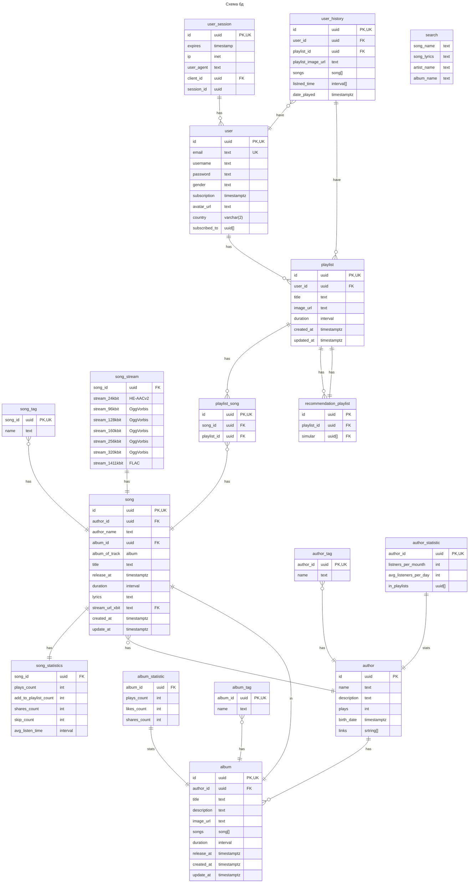
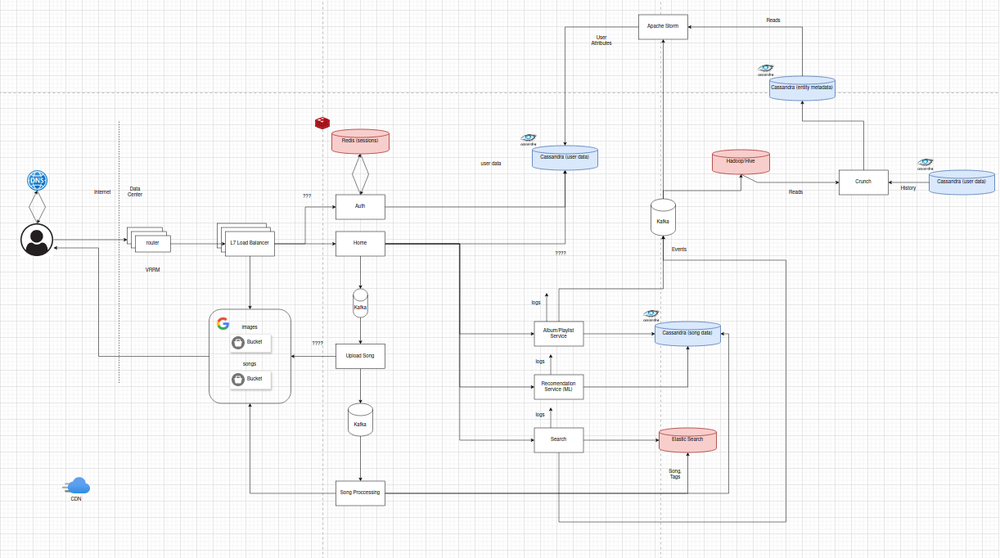

# Spotify System Design

## Содержание

1. [Тема и целевая аудитория](/README.md#часть-1-тема-и-целевая-аудитория)
2. [Рассчет нагрузки](/README.md#часть-2-рассчет-нагрузки)
3. [Глобальная балансировка нагрузки](/README.md#3-глобальная-балансировка-нагрузки)
4. [Локальная балансировка нагрузки](/README.md#4-локальная-балансировка-нагрузки)
5. [Логическая схема БД](/README.md#5-логическая-схема-бд)
6. [Физическая схема БД](/README.md#6-физическая-схема-бд)
7. [Алгоритмы](/README.md#7-алгоритмы)
8. [Технологии](/README.md#8-технологии)
9. [Схема Проекта](/README.md#9-схема-проекта)
11. [Источники](/README.md#источники)

## 1. Тема и целевая аудитория

### Тема: **"Проектирование высоконагруженного музыкального стримингового сервиса"**

[Spotify](https://open.spotify.com/) — стриминговый сервис, позволяющий легально прослушивать музыкальные композиции, аудиокниги и подкасты, не скачивая их на устройство.

### Ключевой функционал MVP

- Регистрация и авторизация
- Создание страницы автора
- Загрузка треков (для автора)
- Создания плейстов (для пользователя)
- Разбиение треков по жанрам
- Рекомендации (на основе подписок и истории прослушивания)
- Стриминг аудио в разном качестве
- Статистика по исполнителю
    1. Количество прослушиваний по странам
    2. Количество подписчиков

### Целевая аудитория

Spotify является мировым лидером в области музыкального стриминга и имеет на ```4Q 2023-его года``` ```30.5%``` от общей доли продаваемых подписок, что составляет ```266 млн.``` пользователей[^1]

По данным[^2] дневная аудитория сервиса составляет ```44%``` => ```618*0.44 = 271.92 млн. ≈ 272 млн.```

- ```618 милионов``` **MAU** на Февраль 6, 2024[^3]
- ```272 миллионов``` **DAU** на Февраль 6, 2024[^3]
- На возрастную группу ```18-35 года``` приходится ```55%``` всех пользователей Spotify[^3]

### Распределение по странам[^3]

| **Страна**     |  **Доля пользователей**           |
|----------------|:---------------------------------:|
| США            |                27.34%             |
| Бразилия       |                4.65%              |
| Великобритания |                4.58%              |
| Мексика        |                4.49%              |
| Индия          |                3.77%              |
| Канада         |                3.41%              |

## 2. Рассчет нагрузки

### Входные данные

| Метрики                                | Значения  |
|----------------------------------------|-----------|
| **Месячная аудетория (MAU)**[^3]       | 618 млн.  |
| **Дневная аудетория (DAU)**[^3]        | 272 млн.  |
| Кол-во новых песен в день[^2]          | 60 тыс.   |
| Кол-во платных пользователей[^2]       | 239 млн.  |
| Кол-во песен[^7]                       | 100 млн.  |
| Кол-во добовляемых песен в день[^2]    | 60 тыс.   |
| Ср.Время использования сервиса[^2]     | 118 мин.  |
| Ср. Кол-во символов в песне[^8]        | 3000 сим. |
| Web Player Bitrate (Free)[^4]          | 128kbit/s |
| Web Player Bitrate (Premium)[^4]       | 256kbit/s |
| Desktop Bitrate (Free)[^4]             | <table> <tr><th>Low</th><th>Medium</th><th>High</th></tr> <tr><td>24kbit/s</td><td>96kbit/s</td><td>160kbit/s</td></tr></table> |
| Desktop Bitrate (Premiunm)[^4]         | <table> <tr><th>Low</th><th>Medium</th><th>High</th><th>Very High</th></tr> <tr><td>24kbit/s</td><td>96kbit/s</td><td>160kbit/s</td><td>320kbit/s</td></tr></table>|

#### Размер 1 аудиофайла для каждого Bitrate

Размер 1 песни для каждого Bitrate

```
197[с] * 24[Кбит/с]  ≈ 0.6 [МБ]
197[c] * 96[Кбит/с]  ≈ 2.3 [МБ]
197[c] * 128[Кбит/с] ≈ 3.1 [МБ]
197[c] * 160[Кбит/с] ≈ 3.8 [МБ]
197[c] * 256[Кбит/с] ≈ 6.2 [МБ]
197[c] * 320[Кбит/с] ≈ 7.7 [МБ]
```

#### Размер хранилища аудиофайлов

```
100*10^6 * (0.6 + 2.3 + 3.1 + 3.8 + 6.2 + 7.7)[МБ] = 2260.2 [TB]
```

#### Размер хранилища текстов песен

Cр.размер текста песени: ```3000 символов``` (__UTF-8__). Тогда:
```
3000 * 100*10^6 = 0.3 TB
```

#### Размер хранилища обложек

Пусть картинка обложки храниться в 3-ех форматах

```64 x 64```, webp = ```2.5 [KB]```

```180 x 180```, webp = ```15 [KB]```

```320 x 320```, webp = ```600 [KB]```

Тогда:

```
(2.5 + 15 + 600) * 100*10^6 = 58 TB
```

#### Увелечение обема хранилища

Каждый день добавляется ```60 тыс.``` песен
Поэтому можно вычислить на сколько увеличивается хранилище каждый день:

```
60*10^3 * (0.6 + 2.3 + 3.1 + 3.8 + 6.2 + 7.7 + (2.5 + 15 + 600)/1024 + 3000/1024/1024)[МБ] = 899153.30 [МБ/сут] = 0.857 [ТБ/сут]
```

### Сетевой трафик
Предположим, что на прослушивание уходит ```80%``` => ```118[мин] * 0.8 = 95[мин]```

Кол-во платных пользоветелей ```239 млн.``` из ```618 млн.``` - ```38%```

#### Дневной трафик
```
DAU * avg_listening_time * (share_of_users * bitrate[kbit/s]) = (272*10^6) * (95 * 60)[сек] * (0.38 * 320 + 0.62 * 160)/8[KB/сек] = 42,791,040,000,000 КБ/cут = 42791 TB/сут
```

Загрузка аудиофайла

```
new_songs_per_day * song_size / day = (60*10^3) * (0.6 + 2.3 + 3.1 + 3.8 + 6.2 + 7.7) / (24 * 3600) * 8 = 80 Мбит/с
```

### RPS

#### Авторизация

Пусть запрос на авторизацию совершается раз в 3 месяца

```
MAU * auth_month / month = (618 * 10^6) * 3[r] / (30 * 24 * 3600)[сек] = 715 RPS
```

#### Получение информации о своем плейлисте

Пусть человек заходит в свою медиатеку 5 раза в день

```
DAU * n_media_use / day =  (272 * 10^6) * 5 / (24 * 3600) = 15740 RPS
```

#### Получение информации об конкретном альбоме, плейлисте

Пусть человек прослушивает 3 плейлиста в день:

```
DAU * n_playlist / day = (272 * 10^6) * 2 / (24 * 3600) = 9445 RPS
```

#### Добавление трека в плейлист

Пусть добавляет в плейлист в среднем 3 трека в день:

```
DAU * n_add_to_playlist / day = (272 * 10^6) * 3 / (24 * 3600) = 9445 RPS
```

#### Создание плейлиста

Пусть человек создает новый плейлист раз в 3 месяца (1 раз в сезон):

```
MAU * n_add-pl / month = (618 * 10^6) * 3 / (30 * 24 * 3600) = 715 RPS
```

#### Стриминг аудиофайла

Средняя продолжительность одного аудиофайла - 210 сек.

Среднее время прослушивания песен в Spotify - 95 мин.

```
usage_time_day / song_duartion_avg = 95 * 60[c] / 210[с] = 27 треков в среднем пользователь слушает в день

DAU * n_songs / day = (272 * 10^6) * 27 / (24 * 3600) = 85000 RPS
```

#### Загрузка аудиофайла

Каждый день добавляется 60 тыс. песен

```
n_day_add_songs / day = (60 * 10^3) / (24 * 3600) = 0.7 RPS
```

#### Получение информации о песне

В среднем пользователь слушает в день 27 треков

```
DAU * n_tr / day = (272 * 10^6) * 27 / (24 * 3600) = 85000 RPS
``` 

#### Рекомендации

Рекомендации плейлистов приходят с каждым запросом плейлиста или альбома.

Предположим, что пользователь слушает по 5 треков из плейлиста => 27 треков в день / 5 = 5 плейлистов в день

```
DAU * n_playlist_day / day = (272 * 10^6) * 5 / (24 * 3600) = 15740 RPS
```

#### Поиск

Пусть человек пользуется поиском 5 раз в день

```
DAU * n_search_day / day = (272 * 10^6) * 5 / (24 * 3600) = 15740 RPS
```

#### Итого

| Сервис                                      | RPS   |
|---------------------------------------------|-------|
| Авторизация                                 | 715   |
| информация о своем плейлисте                | 15740 |
| информация об конкретном альбоме, плейлисте | 9445  |
| Добавление трека в плейлист                 | 9445  |
| Создание плейлиста                          | 715   |
| Стриминг аудиофайла                         | 85000 |
| Загрузка аудиофайла                         | 0.7   |
| информации о песне                          | 85000 |
| Рекомендаций                                | 15740 |
| Поиск                                       | 15740 |

## 3. Глобальная балансировка нагрузки

### Нахождение ЦОДов

| Регион        | % MAU |
|---------------|-------|
| Europe        |  34%  |
| North America |  24%  |
| Latin America |  22%  |
| Rest Of World |  20%  |


```Eu = 210 120 000```

```Na = 148 320 000```

```Sa = 135 960 000```

```India = 23 mil```

- Самый большой трафик идёт из Европы и Северной Америки
- Больше всего пользователей в США
- Больше всего платных подпищиков в Европе


- Вирджиния (США)
- Сан-Франциско (США)
- Лондон (Великобритания)
- Стокгольм (Швеция)
- Москва (Россия)
- Бразилиа (Бразилия)
- Мехико (Мексика)
- Токио (Япония)
- Дели (Индия)
- Сидней (Австралия)


### DNS Балансировка

- Для глобальной балансировки будем использовать **Latency-based DNS**, в результате чего пользователю будет дата-центр с намименьшей задержкой.

### BGP Anycast

- Внутри регионов будем использовать **BGP Anycast** (будем выдавать один **ip** для нескольких дата-центров, отправлять пользователя к ближайшему, **CDN** серверу)

- Будем использовать **CDN** сервера для отдачи статики (музыка, картинки). Для этого будем кэшировать треки в дата-центрах и дальше рассылать по **CDN** серверам, также будем предоставлять провайдерам кэши для ускорения контента(**ISP**), чтобы снять нагрузку с **CDN** серверов.

- Кеш сервер будет, отдавать пользователю контент, а в моменты минимальной нагрузки загружать с **CDN** серверов новый.


## 4. Локальная балансировка нагрузки

### BGP/RIP балансировка

- В ДЦ будет стоять маршрутизатор, с помощью **BGP** маршрутизации будет распределять данные на балансировщик **L7**.

### L7 балансировщик

- Будем использовать **Envoy**. Кеширование некоторых запросов, для того чтобы решить проблему "медленных клиентов". С помощью алгоритма **Weighted Least Connections** будем распределять(балансировать) запросы на сервисы (поднятые в подах **k8s**).

- Отказоустойчивость в рамках сервисов, будет гарантировать **k8s**. Балансировщики будут использовать **heartbeat linux**.

### SSL termination:

- **SSL Termination**, для того чтобы снять нагрузку с серверов по расшифровке **SSL**, это будет делать **L7** балансировщик
- **Session cache** - будет кешировать сессию

## 5. Логическая схема БД



## 6. Физическая схема БД

### Выбор хранилища данных:

- Для сессий воспользуемся redis(user_id, client_id, session_id string), хранилище in-memory и не сильно важно целостность данных, небольшая нагрузка `session`.

- Для хранения и стриминга аудиофайлов объёмом около 2300 ТБ, использовать облачное хранилище, дает гибкую масштабируемость, позволяет оптимизировать затраты на хранение и уменьшить затраты на обслуживание оборудования.
Из облачных сервисов **Amazon S3**, высокая доступность и надежность хранения, а также возможности для стриминга аудиофайлов с использованием **CDN**.

- Для основной БД отлично подойдет NoSQL СУБД - **Cassandra**. Децентрализованная, отказоустойчивая и надёжная база данных "ключ-значение". Решает проблемы наличия единой точки отказа, отказа серверов и о распределении данных между узлами кластера.

- Для хранения статистики по артистам, альбомам, песням будем использовать **ClickHouse**

- Для хранения обложек и песен в формате **ogg** буду использовать Google file System.
Удобное, быстрое, горизонтально рассширемое решение, упростит использование **CDN** 

- В качестве поискового движка будем использовать ElasticSearch. Как удобное решение с полнотекстчовым поиском.

| Table                   | Database      |
|-------------------------|---------------|
| user_session            | Redis         |
| user                    | Cassandra     |
| user_history            | Cassandra     |
| song                    | Cassandra     |
| song_tag                | Cassandra     |
| playlist                | Cassandra     |
| playlist_song           | Cassandra     |
| recommendation_playlist | Cassandra     |
| album                   | Cassandra     |
| album_tag               | Cassandra     |
| song_stream             | S3            |
| song_statistics         | Clickhouse    |
| author_statistic        | Clickhouse    |
| album_statistic         | Clickhouse    |
| search                  | ElasticSearch |

### Популярные запросы

```sql

SELECT * FROM user_history WHERE user_id=<user_id> ORDER BY date_played DESC LIMIT <limit>;

SELECT * FROM playlist WHERE user_id=<user_id>;

SELECT * FROM playlist_song WHERE playlist_id=<playlist_id>;

SELECT * FROM user WHERE user_id=<user_id>;

SELECT * FROM author WHERE author_id=<author_id>;

SELECT * FROM album WHERE album_id=<album_id>;

SELECT * FROM album WHERE author_id=<author_id> ORDER BY release_date;

SELECT * FROM song WHERE song_id=<song_id>;

SELECT * FROM song WHERE author_id=<author_id>;

SELECT * FROM song WHERE author_id=<author_id> AND <song_id> IN (song_ids...)

SELECT simular FROM recomendation_playlist WHERE playlist_id=<playlist_id>;

```

### Индексы

- user: 
    - (user_id)
- user-session:
    - (session_id) Hash
- song:
    - (song_id)
    - (author_id) SAI
- playlist_song:
    - (playlist_id)
- playlist:
    - (user_id)
- author:
    - (author_id)
- album:
    - (author_id)
- user_history:
    - (id)
    - (playlist_id) SAI
    - (date_played) SAI

### Шардинг

- song: 
    - (song_id)
- user:
    - (user_id)
- user_history
    - (user_id)
- playlist
    - (user_id, playlist_id)
- album 
    - (artist_id, album_id)
- artist
    - (artist_id)

### Репликация

- song: 
    - 1 Master -  2 Slave
- user:
    - 1 Master -  2 Slave
- playlist
    - 1 Master -  2 Slave
- album 
    - 1 Master -  2 Slave

## 7. Алгоритмы

### Рекомендации

Для алгоритмов создания и предложения треков по рекомендациям будем использовать **ML**-алгоритмы
- Совместная фильтрация
- Алгоритм факторизации взвешенной матрицы
- Анализ мел-спектрограммы треков (сверточную нейронную сеть **CNN**)
  Определяет тональность, лад, темп и громкость. 
  Когда обнаруживается, что новая песня имеет параметры, аналогичные другим песням, которые вам нравятся, добавляем ее в ваш плейлист.
- Natural Language Processing (**Echo Nest**)

### Стриминг треков

**HLS** (**HTTP Live Streaming**) или **DASH** (**Dynamic Adaptive Streaming over HTTP**)

### Хранение треков

Для хранения используются форматы :
- **Ogg Vorbis** (`96`, `160`, `320` kbps)
- **AAC** (`128`, `256` kbps)
- **HE-AACv2** (`24`kbps) 
- **FLAC** или **WAV** (`1411` kbps, частота дискретизации 44 100 Гц и глубина 16 бит)
максимальный формат для загрузки из него будем конвертировать в остальные 

### Поиск

Для поиска буду использовать **ElasticSearch**, встроенный анализатор текста и полнотекстовй поиска **Apache Lucene**
таблица  `search`

### Модерация

- Загрузка музыки производится через дестрибьюторов и музыкальные лейблы. Они занимаются отсеиванием нежелательного контента на площадке.

- В качестве модерации будем использовать алгоритмы **ML**. Для нахождения, например, нецензурных фраз и навешивания тега ***"Explicit"***

## 8. Технологии

| Технология  | Область применения             | Обоснование                                                                                             |
|-------------|--------------------------------|---------------------------------------------------------------------------------------------------------|
| Golang          | Backend                        | Многопоточность и асинхронность встроены в язык, быстрый протокол gRPC                         |
| React + TS | Frontend                       | Популярный и производительный фреймворк, TS за счет типизации уменьшает число багов   |
| Envoy       | Балансировка нагрузки                       | Написан на Golang. Удобен для работы с микросервисами и оркестраторами. Горизантально маштабируемый.      |
| Grafana + Prometeus    | Мониториг          | Популярность, удобство создания дашбордов, совместимость с golang                                                |
| Redis       | хранилище сессий                        | Высокая производительность  за счет хранения данных в оперативной памяти                                       |
| Google file system   | Хранилище файлов                        | Высокая доступность, производительность и приемлемая стоимость                       |
| Jaeger  | Монтироинг логов | Эффективен и полезен при писке по горячим следам. Совместим с Go |
| Google's CDN | CDN | Cокращение задержек при передаче данных и стриминга аудиофайлов |
| Cassandra  | СУБД                        | Популярность, возможности кастомизации и оптимизации, надёжность, репликация      |
GitLab	| Система контроля версий, CI/CD	| Удобство версионирования и командной разработки, возможность автоматизации сборки, деплоя, запуска тестов и пр. |
| Apache Kafka | Брокер сообщений | Легковесная магтабируемая очередь. Помогает настрить асинхронную обработку событий в системе |
| Apache Storm | Recomendation | Real-time вычисления. Ассинхронность и эффективность |
| HDFS | Хранилище ивентов | Позволяет хранить и меть быстрый доступ к не упроядоченным данным |
| ElasticSearch | Поиск | Полнотекстовый поиск. Встроенные анализаторы (в том числе китайский, корейский, японский) |
| Flink | Агрегация данных в пачках | Поддержание консистентности данных передаваемых через него. Может сливать несколько пайплайнов (потоков данных в один) |
| Apache Storm | Обработка данных в рельном времени | Эфективная обработка даннх в пачках с поддержкой их косистентности |
| ClickHouse | Аналитическая БД | Столбчатая БД для сохранения данных для аналитиков бизнес-кейсов, работы сервиса |
    


## 9. Схема проекта


[Актуальная схема](https://drive.google.com/file/d/1zhMn8_Igj0ZjtwY2olcLpzVfXxT5IkHn/view?usp=sharing)



## 10. Обеспечение надежности

### Резервирование

- Резеривруем ресурсы(**CPU**, **RAM**) сервера, диски и другое оборудование, которое взмет на себя нагрузку в случае сбоя основных компонентов системы

- Резервирование ДатаЦентров: иметь несколько географически распределенных центров обработки данных, способных обслуживать систему в случае отказа основного ДатаЦентра

- Резервирование БД - репликация: создание резервных копий данных и обеспечение доступа к данным в случае отказа основной БД + шардирование данных

- Расчеты пикового трафика и размера хранения с запасом на определенный период

     

### Failover policy
- Игнорирование. При отказе компонента показываем заглушку отсутствия сервиса
- Уменьшение запросов на проблемный хост: недоступность сервиса, система уменьшает количество запросов на этот компонент, чтобы избежать возможной нагрузки и предотвратить негативное влияние на производительность системы.


### Graceful shutdown
- Дает системе время закрыть все активные соединения, завершить обработку текущих задач и спокойно освобождить ресурсы. Такой подход уменьшает фон ошибок.


### Graceful degradation
- Приложение будет продолжать корректно работать для пользователей, у которых отключены некоторые функциональные возможности или использовано устаревшее оборудование или программное обеспечение. Основные функции приложения работают всегда. Система не должна зависеть от 100% функций.

### Observability
- Логирование (Записанные логи могут использоваться для поиска и анализа ошибок, отладки работы приложения, сервисов)
- Мониторинг (отслеживает состояние системы или приложения в реальном времени. Измерение производительности, использования ресурсов, наличия ошибок)

## Источники

[^1]: [Music subscriber market shares 2022](https://midiaresearch.com/blog/music-subscriber-market-shares-2022)

[^2]: [Статистика дохдов и использования Spotify (2023 г.)](https://www.businessofapps.com/data/spotify-statistics/)

[^3]: [Spotify report Q4 2023 (6.02.24)](https://s29.q4cdn.com/175625835/files/doc_financials/2023/q4/Shareholder-Deck-Q4-2023-FINAL.pdf)

[^4]: [Bitrate info](https://support.spotify.com/us/article/audio-quality/)

[^5]: [Similarweb Spotify statistic](https://www.similarweb.com/ru/website/spotify.com/#overview)

[^6]: [Hypestat Spotify statistic](https://hypestat.com/info/spotify.com)

[^7]: [Spotify About Company](https://newsroom.spotify.com/company-info/)

[^8]: [Avarge song text](https://www.researchgate.net/publication/363735501_Song_authorship_attribution_a_lyrics_and_rhyme_based_approach)
